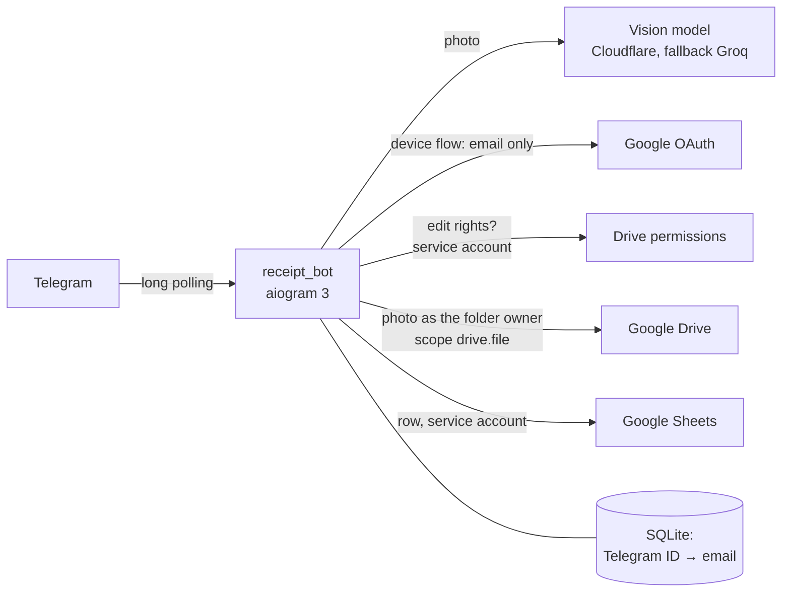

# receipt-bot

[Українська](README.md) · **English**

A Telegram bot for team expense tracking: receipt photo → recognized amount → a person confirms it → the photo goes to
Google Drive and a row to Google Sheets. Bot: [@team_receipts_ua_bot](https://t.me/team_receipts_ua_bot).

The bot talks to people in Ukrainian; quoted bot messages below are translations.

- [How to use it](#how-to-use-it)
- [Architecture](#architecture)
- [Running it](#running-it)
- [Setting up authorization](#setting-up-authorization)
- [How it was tested](#how-it-was-tested)
- [Security](#security)
- [Known limitations](#known-limitations)

## How to use it

1. `/login` (it's in the "/" menu). The bot sends a link and a code; the buttons next to them copy the code and open
   the Google page. Sign in with an account that has edit rights to the sheet. The bot tells you which account you
   signed in with.
2. Send a receipt photo: one or an album, as a photo or as a file (JPEG, PNG, WEBP, up to 10 MB).
3. The bot shows the amount it found. You can confirm it, pick another amount from the receipt, take the amount with
   the bank fee, type it manually or cancel.
4. After confirmation the photo goes to Drive, the row goes to the sheet, and the bot replies "Saved".

Sheet columns: **Added · Receipt date · Sender** (name, @username and Telegram ID) **· Email · Amount · Currency ·
Photo** (Drive link) **· Manual amount · receipt ID**. The header in the sheet itself is in Ukrainian.

## Architecture



| Module | Role |
|---|---|
| `receipt_bot/__main__.py` | Wires everything together: settings, providers, limits, the command menu. Strips secrets from the log |
| `receipt_bot/config.py` | Settings from `.env`. Secrets are `SecretStr` and never printed, even on a config error |
| `receipt_bot/handlers.py` | The Telegram flow: `/login`, photos, buttons, manual amount, limits, receipts awaiting confirmation |
| `receipt_bot/recognition.py` | Vision model over an OpenAI-compatible API, answer validation, primary and fallback provider, a second look at photos without amounts |
| `receipt_bot/google_api.py` | Device flow, edit-rights check, photo to Drive, row to Sheets, failure compensation |
| `receipt_bot/storage.py` | SQLite: the Telegram ID ↔ email link. The bot stores no user tokens |
| `receipt_bot/owner_login.py` | One-time sign-in of the Drive folder owner (see [setup](#setting-up-authorization)) |
| `deploy/receipt-bot.service` | systemd unit with process restrictions |
| `docs/` | Home page and privacy policy on GitHub Pages: Google requires them to publish an OAuth app |

### Decisions and their cost

- **Long polling, not a webhook.** No domain, HTTPS or open ports on the VM. Cost: a single process, which is enough
  for a team.
- **A multimodal model, not OCR.** The model sees both the text and the layout of a receipt, while OCR is slow on a
  CPU and drags in torch. Cost: a dependency on an external API and its free limits. The provider isn't hardcoded:
  any OpenAI-compatible API is set in `.env`. Right now the primary is Cloudflare Workers AI (Gemma) and the fallback
  is Groq (Qwen). The choice was made by a [measurement](#recognition-on-real-documents).
- **The model never saves an amount on its own.** Its answer must match a strict JSON schema, then the code checks
  it: numbers and bounds; VAT, change and cash tendered never become the total; the bank fee is a separate button.
  A person always has the last word. This also guards against prompt injection through text on the photo.
- **A second look when there are no amounts.** The main request is tuned not to call a real bank receipt "not a
  receipt". The cost: on a photo without amounts its verdict is unreliable both ways (earphones came out as "a
  receipt without an amount", the cut-off top of a receipt as "not a receipt"). Then the bot asks the model a
  separate, neutral question: what the photo shows and whether it is a payment document. That is one more request
  (~1 s), only for such photos: a single attempt without waiting, and its failure doesn't block the provider. The
  main request didn't change, so the measurement still holds.
- **Sign-in via OAuth Device Flow with scope `openid email`.** The bot learns only the email and drops the token
  right away. No web server for a redirect and no app verification in Google. Cost: the code can be forwarded to
  someone else (see [limitations](#known-limitations)).
- **A service account checks the rights** through the sheet's `permissions.list`. The check runs **before**
  recognition, so outsiders don't burn the model quota, and again before saving, because access may have been
  revoked. The alternative, checking with the person's own token, needs a sensitive Sheets scope and shows the
  "unverified app" screen.
- **The service account writes the row, the folder owner uploads the photo.** A service account on a regular Gmail
  has no Drive quota (`403 storage quota`). The `drive.file` scope sees only files created by the app. So that the
  owner's refresh token doesn't expire in 7 days, the OAuth app is published (In production).
- **Before saving, the bot checks that Drive and the sheet answer.** If not, it says what it can't connect to and
  uploads nothing, and the daily limit isn't spent. Cost: two short requests per save.
- **No row without a photo.** The photo is uploaded first, then the row is written. If Google clearly refused (4xx)
  or the row request never even reached Google (no connection), the photo is deleted. If Google answered 5xx or
  didn't answer in time, the bot looks the row up by the receipt ID, and if it isn't there, keeps the photo: the row
  may still land later, and a spare photo beats a row with a dead link. The same goes for the photo: if the answer to
  the upload never comes, the bot looks for the file in the folder by its name (it carries the receipt ID) and, if
  it's there, takes that file instead of uploading a second copy.
- **SQLite holds only the Telegram ↔ email link.** Receipts awaiting confirmation live in memory, so after a restart
  old buttons answer "receipt expired". Cost: an unconfirmed receipt then has to be sent again. In return, the
  database has no half-written states to untangle.

## Running it

You need Python 3.13+ (the bot runs on 3.14, the tests pass on 3.13), a bot from [@BotFather](https://t.me/BotFather),
the Google setup from [the next section](#setting-up-authorization) and vision provider keys (Cloudflare Workers AI
and/or Groq, step by step in `.env.example`).

**Locally:**

```bash
python -m venv .venv
.venv/bin/pip install -r requirements.txt      # Windows: .venv\Scripts\pip
cp .env.example .env                            # fill in the values
python -m receipt_bot.owner_login               # once, see setting up authorization
python -m receipt_bot
```

**On a server (systemd):**

```bash
git clone https://github.com/Zonda001/receipt-bot.git ~/receipt-bot && cd ~/receipt-bot
python3 -m venv .venv && .venv/bin/pip install -r requirements.txt
cp .env.example .env && chmod 600 .env          # fill in; put the Google JSON keys in ~/secrets/ with mode 600
.venv/bin/python -m receipt_bot.owner_login
sudo cp deploy/receipt-bot.service /etc/systemd/system/
sudo systemctl daemon-reload && sudo systemctl enable --now receipt-bot
journalctl -u receipt-bot -f                    # the log
```

To update the bot: `git pull`, `pip install -r requirements.txt` (if dependencies changed), then
`sudo systemctl restart receipt-bot`. The unit is written for the `ubuntu` user and the `/home/ubuntu/receipt-bot`
directory. For anything else, adjust `User`, `WorkingDirectory`, `ExecStart` and `ReadWritePaths`.

### `.env` variables

| Variable | What it is |
|---|---|
| `BOT_TOKEN` | Bot token from @BotFather |
| `GOOGLE_SA_KEY_FILE` | Path to the service account's JSON key |
| `GOOGLE_OAUTH_CLIENT_FILE` | Path to the JSON of an OAuth client of type "TVs and Limited Input devices" |
| `SHEET_ID` | The sheet ID from its URL |
| `GOOGLE_OWNER_TOKEN_FILE` | Where `owner_login` puts the folder owner's refresh token |
| `DRIVE_FOLDER_ID` | Folder for the photos. Empty: `owner_login` creates a new one and shows its ID |
| `LLM_BASE_URL`, `LLM_MODEL`, `LLM_API_KEY` | Primary vision provider (OpenAI-compatible API) |
| `LLM_REASONING_EFFORT`, `LLM_EXTRA_BODY` | How to turn off the model's "thinking": every provider does it differently, examples in `.env.example` |
| `LLM_FALLBACK_*` | Fallback provider, same fields. An empty `LLM_FALLBACK_BASE_URL` turns it off |
| `DAILY_RECOGNITIONS` | Daily recognition cap for the whole team (a safety net; 300) |
| `DAILY_RECOGNITIONS_PER_PERSON` | How many of those one Google account may use a day (100) |
| `DB_PATH` | SQLite database (`data/bot.db`) |

## Setting up authorization

In Google Cloud Console:

1. **Project.** Enable the Google Drive API and the Google Sheets API.
2. **Service account.** Create a JSON key and put it on the server (`GOOGLE_SA_KEY_FILE`, mode 600). It needs no
   roles on the project.
3. **Sheet.** Create a sheet and give the service account **editor** rights. Put the ID from the URL into `SHEET_ID`;
   the bot writes the header itself. Give everyone who will send receipts **edit rights personally**, not through a
   group and not "anyone with the link" (why, see [limitations](#known-limitations)). In the Share dialog → ⚙, untick
   "Editors can change permissions and share": otherwise any editor can let an outsider into the bot.
4. **OAuth client** of type **TVs and Limited Input devices**. Download the JSON to `GOOGLE_OAUTH_CLIENT_FILE`.
5. **Google Auth Platform → Branding:** set the home page, the privacy policy (here it's GitHub Pages from `docs/`)
   and the authorized domain. Then **Audience → Publish app**. Without publishing, the owner's refresh token lives
   only 7 days. All scopes here are non-sensitive (`openid`, `email`, `drive.file`), so Google didn't ask for
   verification.

Then on the server, from the bot's directory:

6. `python -m receipt_bot.owner_login`, as the bot's user, not through `sudo`. The folder owner opens the link,
   enters the code and allows access to files created by the app. The command shows which account signed in and
   checks that Google really granted `drive.file`. Then it either creates the "Чеки (бот)" folder (if
   `DRIVE_FOLDER_ID` is empty) or checks that this account is the **owner** of the existing one: the folder is shared
   with the team, so not only the owner can see it. Only after that does it save the refresh token with mode 600. If
   something goes wrong, the previous token stays intact. A folder created by hand in Drive is invisible to the bot:
   `drive.file` only covers what the app itself created.
7. If the folder was created anew, put its ID into `DRIVE_FOLDER_ID` and share it with the team in Drive. Then
   restart the bot.

How a person signs in: `/login` → device flow with scope `openid email` → the bot gets a verified email and drops the
token → the service account checks edit rights to the sheet. Without rights, the email isn't stored. One email can
be linked to only one Telegram account: if the same Google account signs in from another Telegram, the previous one
is unlinked and gets a warning.

## How it was tested

### Automated tests

```bash
pip install -r requirements-dev.txt
pytest                                          # 231 tests, no network: Google and the providers are fakes
```

| File | What it checks |
|---|---|
| `tests/test_recognition.py` | Validation of the model's answer: amounts, currency, date. VAT, change and cash are never the total, a cap on the number of buttons. The photo is checked before sending: formats, "bombs" with a giant resolution or thousands of scans, truncated JPEGs |
| `tests/test_providers.py` | Primary and fallback provider: daily limit, provider pause after a failure, `retry-after`, the queue. Bank fee (the "with fee" button, no double counting). Polish and English labels. The second look at photos without amounts: the verdict, seven kinds of failure without blocking the provider, skipping instead of waiting, the main request stays unchanged. A provider's error text can't fake a journal line |
| `tests/test_google.py` | Device flow (waiting, denial, expired code, unverified email). Edit rights: "anyone with the link" doesn't count. Photo, then row, and compensation: Drive down, Sheets refusing (4xx, the photo is deleted), 5xx or a timeout (the photo stays). No connection: no photo is left behind. The answer to an upload got lost: the photo is taken by name, no second copy. The Drive and sheet check before saving names what's down. Parallel access checks make one request. One email, one Telegram. Save and byte limits per Google account. Names like `=IMPORTXML(...)` stay text, and an RLO in a name can't hide the ID. `owner_login` |
| `tests/test_concurrency.py` | Races: two quick "type manually" taps on different receipts. Daily quota accounting when the provider answers 429 |
| `tests/test_handlers_and_config.py` | The command menu matches the real handlers. Login buttons. The login code gets through even without buttons, and if it doesn't get through at all, the login is cancelled. Config errors don't print values. "Not a receipt" leaves only manual entry and cancel. A daily recognition share per person. If Google is down, a save stops before the photo is uploaded; "not sure" doesn't say "not saved" |
| `tests/test_logging.py` | Tokens are stripped from the log, tracebacks included |

### Recognition on real documents

A measurement on 25.09 on 24 real documents (photos from Telegram, 960×1280): 2 supermarket receipts, 14 PrivatBank
payment receipts, a pharmacy, a long receipt and crumpled ones, an invoice, a currency exchange, a sideways receipt.

| Variant | Correct amount |
|---|---|
| Old prompt ("shop receipts"), `is_receipt` first in the schema — Groq Qwen | 2/24 (19 times "not a receipt") |
| New prompt (any payment documents), amounts before the verdict — Groq Qwen | 11/11 (then the daily limit) |
| The same — Cloudflare Gemma 4 | **22/24**, both errors a wrong digit (591.20 instead of 591.26) |

Hence the choice: Cloudflare as the primary (~1100 receipts a day for free, ~9 neurons per receipt), Groq as the
fallback (~80 a day). Only a person catches a wrong digit, so the bot never saves an amount without confirmation.

### Live tests on the deployed bot

- **25.09:** 21 photos, including an album of payment receipts. The switch to the fallback provider (Groq) worked
  live.
- **26.09, the full flow:** `/login` with an account that has access → photo → confirmation → a row in the sheet and
  a photo in Drive with the same receipt ID. The bot took the date from the receipt itself (25.09), not the date it
  was sent.
- **26.09, an account without access:** the bot named the account and refused, the email wasn't stored. A photo after
  that got "Sign in first", with no recognition and no record.
- **26.09:** the command menu and the login buttons ("Copy code", "Open Google") in the Telegram client.
- **27.09, a run of real receipts:** an album of receipts and a few more separately. Every row in the sheet has its
  own photo in Drive with the same ID, no stray photos (checked with the service account). "Amount + fee" was picked
  on bank payment receipts. A manual amount after an invalid "abc" was saved and marked as manual. Cancel writes
  nothing.
- **27.09, not a receipt:** on a photo of earphones the model said "a receipt without an amount", and the bot replied
  "Couldn't find the amount on the receipt". After the fix (the second look), 7 non-receipt photos in a row got
  "Doesn't look like a receipt". On two of them the main request said "receipt" again.
- **27.09, an old button:** a receipt was sent, the bot was restarted, "Confirm" → "Receipt expired", no row added.
- **28.09, the sheet unreachable** (`sheets.googleapis.com` blocked on the VM): no row was added. But the photo stayed
  in Drive, and the message contradicted itself ("not sure it was saved" and right after it "not saved"). Now the bot
  checks Drive and the sheet before saving and tells "no connection" apart from "didn't answer in time".
- **28.09, the retest:** with the same block the bot said "Can't connect to Google Sheets" and uploaded nothing. After
  unblocking, the second tap hit a real timeout: Drive made the file in 2 s, but the answer didn't come within 30 s,
  so the third tap uploaded a second copy of the photo (still one row). Now after such a timeout the bot looks the file
  up by name and takes it. The spare copies from the tests were removed: every row has exactly one photo.

### Error scenarios

| Situation | What the person sees | What's in the data | How it was checked |
|---|---|---|---|
| Not signed in | "Sign in with Google first" | nothing | live 26.09 |
| Account without edit rights | "Account X has no access…" | nothing, the email isn't stored | live 26.09, `test_access_needs_edit_rights` |
| Not a photo, a broken or a "heavy" file | refused before the model | nothing | `test_prepare_image_*`, `test_non_image_is_never_uploaded` |
| Not a receipt | "Doesn't look like a receipt" + manual entry | nothing | live 27.09 (7 of 7), `test_photo_without_amounts_that_is_not_a_document_is_not_a_receipt` |
| Amount not recognized | "Couldn't find the amount…" + manual entry | nothing until confirmed | on the real model 27.09 (top of a receipt without amounts), `test_unreadable_document_keeps_manual_entry_date_and_currency` |
| Several amounts | buttons to choose | nothing until chosen | live 27.09 (amount or amount with fee), `test_no_total_keeps_candidates_for_choice` |
| Model down or out of quota | fallback provider; an honest text about how long to wait | nothing | `test_chain_*`, live 25.09 |
| Drive down | "Couldn't save to Google" | nothing | `test_drive_failure_writes_nothing` |
| Drive or the sheet unreachable | "Can't connect to Google Drive" or "…to Google Sheets" | nothing: no photo uploaded, no limit spent | `test_save_stops_before_the_upload_when_google_is_down`, `test_ping_*` |
| Connection lost in the middle of a save | "Can't connect to Google" | the photo is deleted | `test_unreachable_sheets_removes_the_photo`, `test_unreachable_drive_uploads_nothing` |
| Drive ok, Sheets refused (4xx) | the same | the photo is deleted | `test_sheet_failure_removes_the_photo` |
| Sheets 5xx or Google didn't answer in time | either "Saved" or "not sure it was saved, check the sheet" | the row is looked up by ID; if it isn't there, the photo stays | `test_sheet_5xx_keeps_the_photo`, `test_timeout_*` |
| The photo uploaded, the answer got lost | "Saved" | the photo is found by name, no second copy | live 28.09 (before the fix: a second copy), `test_upload_timeout_*` |
| Manual amount not a number or ≤ 0 | "Enter a number" | nothing | live 27.09, `test_parse_amount_rejects` |
| "Confirm" tapped twice | "Already processing…" | one row | only in code: the status changes before the first `await`, no automated test |
| An old button (after a restart) | "Receipt expired" | nothing | live 27.09 (bot restart), no automated test |
| Flooding or a daily limit | "Too many…" or "limit reached" | — | `test_save_limit_*`, `test_one_person_cannot_use_up_the_team_quota` |

## Security

- Secrets live only in `.env` and `~/secrets/` with mode 600, outside git. `.gitignore` ignores `.env*`, `*.json`,
  `*.key`, `data/*`. The git history has been checked: no keys in any commit.
- The log: the bot token and provider keys are stripped even from tracebacks. Google errors are logged with the code
  only, without the response text. Emails of people without access don't get into the log.
- The bot works only in private chats: a `/login` code sent to a group could be entered by anyone.
- Limits: 20 photos a minute per Telegram account; per Google account a day, 100 saves, 200 MB of photos and 100
  recognitions; 300 recognitions a day for the whole team; 3 `/login` attempts a minute per person and 20 for
  everyone.
- systemd: writing is allowed only to `data/`, no new privileges, a system call filter and a memory ceiling.
- There were several rounds of security review, the last one on 27.09 a full one: the code (by two independent
  agents), the VM, the git history, GitHub and the dependencies. No critical or high findings; the medium ones are
  fixed, the rest are fixed or described below. Dependencies were checked against the OSV database (no known
  vulnerabilities), Dependabot is on.

## Known limitations

- **Sign-in by code (device flow).** If a person enters a code someone forwarded to them, the bot links someone
  else's Telegram to their account. What limits this: one email, one Telegram (the previous account is unlinked and
  warned), every row in the sheet has the sender's Telegram ID, a Google account gets no more than 100 saves and
  200 MB of photos a day, and the bot always names the account you signed in with.
- **Access** comes only from edit rights given to a specific person. Google groups, domain-wide access (a personal
  account may have a corporate address) and "anyone with the link" (the bot is public) don't count. Revoking access
  takes effect within a minute: that's how long the bot caches the sheet's permissions.
- **If Google answered 5xx or didn't answer in time**, the bot looks the row up by the receipt ID. If it isn't there,
  the bot keeps the photo and asks to check the sheet before retrying. So in a rare case the folder gets a spare
  photo without a row (its ID is in the log).
- **A wrong digit.** The model can get a digit wrong (2 of 24 in the measurement), so the amount always goes to
  confirmation.
- **Free limits.** Cloudflare gives ~1100 receipts a day, Groq ~80. `DAILY_RECOGNITIONS` keeps a cap for the whole
  team. The second look isn't counted in the cap: a photo without amounts costs up to three requests, so a cap of 300
  means at worst up to 900 requests a day, still within Cloudflare.
- **Duplicates.** The same receipt can be saved twice: the bot doesn't compare new receipts with the sheet (checked
  live on 27.09). The next step: a "a similar receipt is already there" warning based on the amount and the receipt
  date.
- **Receipts awaiting confirmation** are lost on restart: they have to be sent again. **The limit counters** also
  live in memory and reset on restart.
- **The folder owner's token.** If the owner revokes the app's access, photos stop uploading. The fix is running
  `python -m receipt_bot.owner_login` again and restarting the bot. Google keeps at most 100 refresh tokens per
  account and OAuth client, so an owner who signs in to the bot with `/login` a hundred times pushes this token out
  too. A separate OAuth client for `owner_login` is the sturdier setup.
- **`/logout` in the middle of a sign-in.** If you log out exactly when Google has confirmed the sign-in and the bot
  is still checking access, the link is written anyway. The window is a fraction of a second, and another `/logout`
  removes it.
- **The shared `/login` cap** (20 a minute for everyone). A few accounts can keep it busy, and then sign-in is
  unavailable for a minute to your own people too. Those already signed in aren't affected.
- **CSV export.** In the sheet text fields are stored as text (RAW), but Excel will treat a name starting with `=` as a
  formula when opening a CSV. Open CSV exports as text.
- **Dependencies** are given as version ranges, without a lock file: `pip install` on a new server may pick newer
  versions. The tested versions are the ones on the VM (`pip freeze`).
- **The bot process** runs as the `ubuntu` user, though under strict systemd restrictions (see
  `deploy/receipt-bot.service`). A dedicated system user is the next step.
