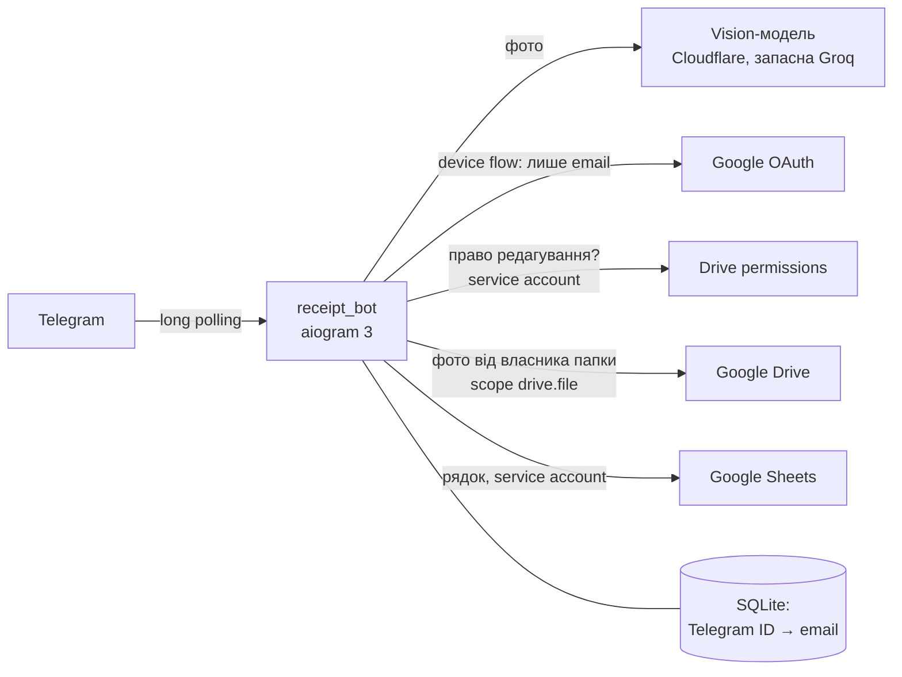

# receipt-bot

Telegram-бот для командного обліку чеків: фото чека → розпізнана сума → підтвердження людиною → фото в Google Drive,
рядок у Google Sheets. Бот: [@team_receipts_ua_bot](https://t.me/team_receipts_ua_bot).

- [Як ним користуватись](#як-ним-користуватись)
- [Архітектура](#архітектура)
- [Запуск](#запуск)
- [Налаштування авторизації](#налаштування-авторизації)
- [Як це тестувалось](#як-це-тестувалось)
- [Безпека](#безпека)
- [Відомі обмеження](#відомі-обмеження)

## Як ним користуватись

1. `/login` (є в меню «/»). Бот дає посилання й код, а кнопки поруч копіюють код і відкривають сторінку Google.
   Увійти треба акаунтом, якому видано право редагування таблиці. Бот відповідає, яким акаунтом ти увійшов.
2. Надіслати фото чека: одне або альбом, як фото чи як файл (JPEG, PNG, WEBP, до 10 МБ).
3. Бот показує знайдену суму. Можна підтвердити її, вибрати іншу суму з чека, взяти суму з комісією, ввести
   вручну або скасувати.
4. Після підтвердження фото йде в Drive, рядок у таблицю, а бот відповідає «Записано».

Колонки таблиці: **Додано · Дата чека · Відправник** (ім'я, @username і Telegram ID) **· Email · Сума · Валюта ·
Фото** (посилання на Drive) **· Сума вручну · ID** чека.

## Архітектура



| Модуль | Роль |
|---|---|
| `receipt_bot/__main__.py` | Збирає все докупи: налаштування, провайдерів, ліміти, меню команд. Вирізає секрети з журналу |
| `receipt_bot/config.py` | Налаштування з `.env`. Секрети в `SecretStr` не друкуються навіть при помилці в конфігу |
| `receipt_bot/handlers.py` | Сценарій Telegram: `/login`, фото, кнопки, ручна сума, ліміти, чеки в очікуванні |
| `receipt_bot/recognition.py` | Vision-модель через OpenAI-сумісний API, перевірка відповіді, основний і запасний провайдер |
| `receipt_bot/google_api.py` | Device flow, перевірка права редагування, фото в Drive, рядок у Sheets, компенсація збоїв |
| `receipt_bot/storage.py` | SQLite: зв'язка Telegram ID ↔ email. Токенів користувачів бот не зберігає |
| `receipt_bot/owner_login.py` | Одноразовий вхід власника папки Drive (див. [налаштування](#налаштування-авторизації)) |
| `deploy/receipt-bot.service` | systemd-юніт з обмеженнями процесу |
| `docs/` | Головна сторінка і privacy policy на GitHub Pages: Google вимагає їх для публікації OAuth-застосунку |

### Рішення і їхня ціна

- **Long polling, а не вебхук.** Не потрібні домен, HTTPS і відкриті порти на VM. Ціна: один процес, але для
  команди цього достатньо.
- **Розпізнавання мультимодальною моделлю, а не OCR.** Модель бачить і текст, і структуру чека, а OCR на CPU
  повільний і тягне torch. Ціна: залежність від зовнішнього API та його безкоштовних лімітів. Провайдер у коді не
  зашитий, будь-який OpenAI-сумісний API задається в `.env`. Зараз основний провайдер Cloudflare Workers AI (Gemma),
  запасний Groq (Qwen). Вибір зроблено за [заміром](#розпізнавання-на-справжніх-документах).
- **Модель ніколи не записує суму сама.** Відповідь має відповідати суворій JSON-схемі, далі її перевіряє код:
  числа й межі, ПДВ, решта й готівка ніколи не стають підсумком, комісія йде окремою кнопкою. Останнє слово завжди
  за людиною. Це заодно захищає від prompt injection через текст на фото.
- **Вхід через OAuth Device Flow зі scope `openid email`.** Бот дізнається лише email, а токен одразу викидає.
  Не потрібні вебсервер для redirect і верифікація застосунку в Google. Ціна: код можна переслати іншій людині
  (див. [обмеження](#відомі-обмеження)).
- **Право перевіряє service account** через `permissions.list` таблиці. Перевірка йде і **до** розпізнавання, щоб
  сторонні не витрачали квоту моделі, і перед записом, бо доступ могли забрати. Альтернатива, перевірка токеном
  самої людини, вимагає sensitive scope Sheets і показує екран «неперевірений застосунок».
- **Рядок пише service account, а фото вантажить власник папки.** У service account на звичайному Gmail немає
  квоти Drive (`403 storage quota`). Scope `drive.file` бачить лише файли, створені застосунком. Щоб refresh-токен
  власника не згорав за 7 днів, OAuth-застосунок опубліковано (In production).
- **Жодного рядка без фото.** Спершу вантажиться фото, потім пишеться рядок. Якщо рядок не записався, фото
  видаляється. Якщо Google не відповів вчасно, бот шукає рядок за ID чека і лише потім вирішує, що робити з фото.
- **SQLite тримає тільки зв'язку Telegram ↔ email.** Чеки в очікуванні живуть у пам'яті, тож після рестарту старі
  кнопки відповідають «чек застарів». Ціна: непідтверджений чек тоді треба надіслати заново. Зате в базі нема
  напівзаписаних станів, які довелося б розбирати.

## Запуск

Потрібні Python 3.13+ (бот працює на 3.14, тести проходять на 3.13), бот від [@BotFather](https://t.me/BotFather), Google-налаштування
з [наступного розділу](#налаштування-авторизації) і ключі vision-провайдера (Cloudflare Workers AI та/або Groq,
покроково описано в `.env.example`).

**Локально:**

```bash
python -m venv .venv
.venv/bin/pip install -r requirements.txt      # Windows: .venv\Scripts\pip
cp .env.example .env                            # заповнити значення
python -m receipt_bot.owner_login               # один раз, див. налаштування авторизації
python -m receipt_bot
```

**На сервері (systemd):**

```bash
git clone https://github.com/Zonda001/receipt-bot.git ~/receipt-bot && cd ~/receipt-bot
python3 -m venv .venv && .venv/bin/pip install -r requirements.txt
cp .env.example .env && chmod 600 .env          # заповнити; JSON-ключі Google покласти в ~/secrets/ з правами 600
.venv/bin/python -m receipt_bot.owner_login
sudo cp deploy/receipt-bot.service /etc/systemd/system/
sudo systemctl daemon-reload && sudo systemctl enable --now receipt-bot
journalctl -u receipt-bot -f                    # журнал
```

Щоб оновити бота: `git pull`, `pip install -r requirements.txt` (якщо змінилися залежності), потім
`sudo systemctl restart receipt-bot`. Юніт написано під користувача `ubuntu` і теку `/home/ubuntu/receipt-bot`.
Для інших поправ `User`, `WorkingDirectory`, `ExecStart` і `ReadWritePaths`.

### Змінні `.env`

| Змінна | Що це |
|---|---|
| `BOT_TOKEN` | Токен бота від @BotFather |
| `GOOGLE_SA_KEY_FILE` | Шлях до JSON-ключа service account |
| `GOOGLE_OAUTH_CLIENT_FILE` | Шлях до JSON OAuth-клієнта типу «TVs and Limited Input devices» |
| `SHEET_ID` | ID таблиці з її URL |
| `GOOGLE_OWNER_TOKEN_FILE` | Куди `owner_login` кладе refresh-токен власника папки |
| `DRIVE_FOLDER_ID` | Папка для фото. Порожня: `owner_login` створить нову і покаже ID |
| `LLM_BASE_URL`, `LLM_MODEL`, `LLM_API_KEY` | Основний vision-провайдер (OpenAI-сумісний API) |
| `LLM_REASONING_EFFORT`, `LLM_EXTRA_BODY` | Як вимкнути «міркування» моделі: у кожного провайдера по-своєму, приклади в `.env.example` |
| `LLM_FALLBACK_*` | Запасний провайдер, ті самі поля. Порожній `LLM_FALLBACK_BASE_URL` вимикає запасного |
| `DAILY_RECOGNITIONS` | Стеля розпізнавань на добу на всю команду (запобіжник; 300) |
| `DB_PATH` | SQLite-база (`data/bot.db`) |

## Налаштування авторизації

У Google Cloud Console:

1. **Проєкт.** Увімкнути Google Drive API і Google Sheets API.
2. **Service account.** Створити ключ JSON і покласти його на сервер (`GOOGLE_SA_KEY_FILE`, права 600). Ролі на
   проєкт не потрібні.
3. **Таблиця.** Створити таблицю й видати service account'у права **редактора**. ID з URL записати в `SHEET_ID`,
   заголовок бот допише сам. Кожній людині, яка надсилатиме чеки, видати право **редагування особисто**, а не
   через групу і не «всім, у кого є посилання» (чому так, див. [обмеження](#відомі-обмеження)).
4. **OAuth client** типу **TVs and Limited Input devices**. Завантажити JSON у `GOOGLE_OAUTH_CLIENT_FILE`.
5. **Google Auth Platform → Branding:** вказати головну сторінку, privacy policy (тут це GitHub Pages з `docs/`) і
   authorized domain. Потім **Audience → Publish app**. Без публікації refresh-токен власника живе лише 7 днів.
   Усі scope тут non-sensitive (`openid`, `email`, `drive.file`), тож верифікації Google не вимагав.

Потім на сервері, з теки бота:

6. `python -m receipt_bot.owner_login`, від користувача бота, не через `sudo`. Власник папки відкриває посилання,
   вводить код і дозволяє доступ до файлів, створених застосунком. Команда показує, яким акаунтом виконано вхід,
   і перевіряє, що Google справді видав `drive.file`. Далі вона або створює папку «Чеки (бот)» (якщо
   `DRIVE_FOLDER_ID` порожній), або перевіряє, що цей акаунт **власник** наявної: папкою діляться з командою,
   тож бачити її може не лише власник. Лише після цього зберігає refresh-токен з правами 600. Якщо щось пішло не
   так, попередній токен лишається цілим. Папку, створену вручну в Drive, бот не побачить: `drive.file` дає доступ
   лише до створеного самим застосунком.
7. Якщо папку створено заново, записати її ID у `DRIVE_FOLDER_ID` і поділитися нею з командою в Drive. Потім
   перезапустити бота.

Як відбувається вхід людини: `/login` → device flow зі scope `openid email` → бот отримує підтверджений email і
викидає токен → service account перевіряє право редагування таблиці. Якщо права нема, email не зберігається.
Один email можна прив'язати лише до одного Telegram: якщо той самий акаунт увійде з іншого Telegram, попередній
відключається й отримує попередження.

## Як це тестувалось

### Автотести

```bash
pip install -r requirements-dev.txt
pytest                                          # 175 тестів, без мережі: Google і провайдери замінено фейками
```

| Файл | Що перевіряє |
|---|---|
| `tests/test_recognition.py` | Перевірка відповіді моделі: суми, валюта, дата. ПДВ, решта й готівка ніколи не підсумок, ліміт кількості кнопок. Фото перевіряється до відправки: формати, «бомби» з гігантською роздільністю, обрізані JPEG |
| `tests/test_providers.py` | Основний і запасний провайдер: денний ліміт, пауза провайдера після збою, `retry-after`, черга. Комісія банку (кнопка «з комісією», без подвійного обліку). Польські й англійські мітки |
| `tests/test_google.py` | Device flow (очікування, відмова, прострочений код, неперевірений email). Право редагування: «за посиланням» не рахується. Фото, потім рядок, і компенсація: Drive впав, Sheets впав, тайм-аут з рядком і без. Один email — один Telegram. Ліміт записів. Імена на кшталт `=IMPORTXML(...)` лишаються текстом. `owner_login` |
| `tests/test_concurrency.py` | Гонки: два швидкі тапи «ввести вручну» на різних чеках. Облік денної квоти, коли провайдер відповідає 429 |
| `tests/test_handlers_and_config.py` | Меню команд відповідає реальним хендлерам. Кнопки входу. Код входу доходить навіть без кнопок, а якщо не дійшов зовсім, вхід скасовується. Помилки конфігу не друкують значень |
| `tests/test_logging.py` | Токени вирізаються з журналу, зокрема з трейсбеків |

### Розпізнавання на справжніх документах

Замір 25.09 на 24 справжніх документах (фото з Telegram, 960×1280): 2 чеки супермаркету, 14 квитанцій ПриватБанку,
аптека, довгий і зім'яті чеки, рахунок, обмін валют, чек боком.

| Варіант | Правильна сума |
|---|---|
| Старий промпт ("shop receipts"), `is_receipt` першим у схемі — Groq Qwen | 2/24 (19 разів "не чек") |
| Новий промпт (будь-які документи про оплату), суми перед вердиктом — Groq Qwen | 11/11 (далі денний ліміт) |
| Те саме — Cloudflare Gemma 4 | **22/24**, обидві помилки — хибна цифра (591.20 замість 591.26) |

Звідси вибір: Cloudflare основний (~1100 чеків на добу безкоштовно, ~9 нейронів на чек), Groq запасний (~80 на добу).
Хибну цифру ловить лише людина, тому бот ніколи не записує суму без підтвердження.

### Живі тести на задеплоєному боті

- **25.09:** 21 фото, зокрема альбом квитанцій. Перехід на запасний провайдер (Groq) спрацював наживо.
- **26.09, повний сценарій:** `/login` акаунтом із доступом → фото → підтвердження → рядок у таблиці й фото в Drive
  з однаковим ID чека. Дату бот узяв із самого чека (25.09), а не дату відправки.
- **26.09, акаунт без доступу:** бот назвав акаунт і відмовив, email не зберігся. Фото після цього отримало відповідь
  «Спершу увійди», без розпізнавання і без запису.
- **26.09:** меню команд і кнопки входу («Скопіювати код», «Відкрити Google») на клієнті Telegram.

### Сценарії помилок

| Ситуація | Що бачить людина | Що в даних | Чим перевірено |
|---|---|---|---|
| Не увійшов | «Спершу увійди через Google» | нічого | вживу 26.09 |
| Акаунт без права редагування | «Акаунт X не має доступу…» | нічого, email не зберігається | вживу 26.09, `test_access_needs_edit_rights` |
| Не фото або битий файл | відмова ще до моделі | нічого | `test_prepare_image_*`, `test_non_image_is_never_uploaded` |
| Не чек | «Не схоже на чек» + ручне введення | нічого | `test_not_receipt_drops_everything` |
| Кілька сум | кнопки вибору | нічого до вибору | `test_no_total_keeps_candidates_for_choice` |
| Модель впала або ліміт | запасний провайдер; чесний текст, скільки чекати | нічого | `test_chain_*`, вживу 25.09 |
| Drive впав | «Не вдалося записати в Google» | нічого | `test_drive_failure_writes_nothing` |
| Drive ок, Sheets впав | те саме | фото видаляється | `test_sheet_failure_removes_the_photo` |
| Google не відповів вчасно | або «Записано», або «перевір таблицю перед повтором» | без дублів | `test_timeout_*` |
| Ручна сума не число або ≤ 0 | «Введи число» | нічого | `test_parse_amount_rejects` |
| Подвійне натискання «Підтвердити» | «Вже обробляю…» | один рядок | лише в коді: статус міняється до першого `await`, автотесту нема |
| Стара кнопка (після рестарту) | «Чек застарів» | нічого | лише в коді, автотесту нема |
| Флуд | «Забагато…» | — | `test_save_limit_per_user` та інші |

## Безпека

- Секрети лежать лише в `.env` і `~/secrets/` з правами 600, поза git. `.gitignore` ігнорує `.env*`, `*.json`, `*.key`,
  `data/*`. Історію git перевірено: ключів нема в жодному коміті.
- Журнал: токен бота й ключі провайдерів вирізаються навіть із трейсбеків. Помилки Google пишуться без тексту
  відповіді, лише з кодом. Email людей без доступу в журнал не потрапляє.
- Бот працює лише в особистих чатах: код `/login`, надісланий у групу, міг би ввести будь-хто.
- Ліміти: 20 фото на хвилину і 100 записів на добу на людину, 300 розпізнавань на добу на всю команду, 3 спроби
  `/login` на хвилину на людину і 20 на всіх.
- systemd: запис дозволено лише в `data/`, без нових привілеїв, з фільтром системних викликів і стелею пам'яті.
- Було кілька раундів ревю безпеки. `pip-audit` вразливостей не знаходить, Dependabot увімкнено.

## Відомі обмеження

- **Вхід через код (device flow).** Якщо людина введе код, який їй хтось переслав, бот прив'яже чужий Telegram до
  її акаунта. Що це обмежує: один email — один Telegram (попередній акаунт відключається й отримує попередження),
  у кожному рядку таблиці є Telegram ID відправника, записів не більше 100 на людину за добу, і бот завжди називає,
  яким акаунтом ти увійшов.
- **Доступ** дають лише права редагування, видані конкретній людині. Не рахуються Google-групи, доступ на весь
  домен (особистий акаунт може мати корпоративну адресу) і «будь-хто з посиланням» (бот публічний).
- **Якщо Google не відповів вчасно**, бот шукає рядок за ID чека. Якщо й це не вдалося, він просить перевірити
  таблицю перед повтором, а фото не видаляє.
- **Хибна цифра.** Модель може помилитися в цифрі (2 з 24 у замірі), тому сума завжди йде на підтвердження.
- **Безкоштовні ліміти.** Cloudflare дає ~1100 чеків на добу, Groq ~80. `DAILY_RECOGNITIONS` тримає стелю для всієї
  команди.
- **Чеки в очікуванні** губляться при рестарті: їх треба надіслати ще раз.
- **Токен власника папки.** Якщо власник відкличе доступ застосунку, фото перестануть вантажитись. Лікується
  повторним `python -m receipt_bot.owner_login` і рестартом бота.
- **Процес бота** працює від користувача `ubuntu`, хоч і під жорсткими обмеженнями systemd (див.
  `deploy/receipt-bot.service`). Окремий системний користувач — наступний крок.
