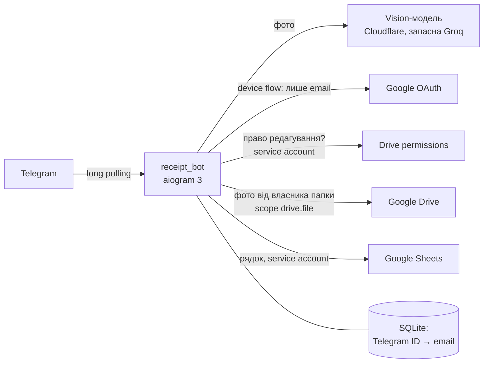

# receipt-bot

**Українська** · [English](README.en.md)

Telegram-бот для командного обліку чеків: фото чека → розпізнана сума → підтвердження людиною → фото в Google Drive,
рядок у Google Sheets. Бот: [@team_receipts_ua_bot](https://t.me/team_receipts_ua_bot).

- [Як ним користуватись](#як-ним-користуватись)
- [Архітектура](#архітектура)
- [Запуск](#запуск)
- [Налаштування авторизації](#налаштування-авторизації)
- [Як це тестувалось](#як-це-тестувалось)
- [Безпека](#безпека)
- [Відомі обмеження](#відомі-обмеження)

## Як ним користуватись

1. `/login` (є в меню «/»). Бот дає посилання й код, а кнопки поруч копіюють код і відкривають сторінку Google.
   Увійти треба акаунтом, якому видано право редагування таблиці. Бот відповідає, яким акаунтом ти увійшов.
2. Надіслати фото чека: одне або альбом, як фото чи як файл (JPEG, PNG, WEBP, до 10 МБ).
3. Бот показує знайдену суму. Можна підтвердити її, вибрати іншу суму з чека, взяти суму з комісією, ввести
   вручну або скасувати.
4. Після підтвердження фото йде в Drive, рядок у таблицю, а бот відповідає «Записано».

Колонки таблиці: **Додано · Дата чека · Відправник** (ім'я, @username і Telegram ID) **· Email · Сума · Валюта ·
Фото** (посилання на Drive) **· Сума вручну · ID** чека.

## Архітектура


```mermaid
flowchart LR
    T[Telegram] -- long polling --> B[receipt_bot<br/>aiogram 3]
    B -- фото --> V[Vision-модель<br/>Cloudflare, запасна Groq]
    B -- device flow: лише email --> O[Google OAuth]
    B -- право редагування?<br/>service account --> P[Drive permissions]
    B -- фото від власника папки<br/>scope drive.file --> D[Google Drive]
    B -- рядок, service account --> S[Google Sheets]
    B --- DB[(SQLite:<br/>Telegram ID → email)]
```

| Модуль | Роль |
|---|---|
| `receipt_bot/__main__.py` | Збирає все докупи: налаштування, провайдерів, ліміти, меню команд. Вирізає секрети з журналу |
| `receipt_bot/config.py` | Налаштування з `.env`. Секрети в `SecretStr` не друкуються навіть при помилці в конфігу |
| `receipt_bot/handlers.py` | Сценарій Telegram: `/login`, фото, кнопки, ручна сума, ліміти, чеки в очікуванні |
| `receipt_bot/recognition.py` | Vision-модель через OpenAI-сумісний API, перевірка відповіді, основний і запасний провайдер, другий погляд на фото без сум |
| `receipt_bot/google_api.py` | Device flow, перевірка права редагування, фото в Drive, рядок у Sheets, компенсація збоїв |
| `receipt_bot/storage.py` | SQLite: зв'язка Telegram ID ↔ email. Токенів користувачів бот не зберігає |
| `receipt_bot/owner_login.py` | Одноразовий вхід власника папки Drive (див. [налаштування](#налаштування-авторизації)) |
| `deploy/receipt-bot.service` | systemd-юніт з обмеженнями процесу |
| `docs/` | Головна сторінка і privacy policy на GitHub Pages: Google вимагає їх для публікації OAuth-застосунку |

### Рішення і їхня ціна

- **Long polling, а не вебхук.** Не потрібні домен, HTTPS і відкриті порти на VM. Ціна: один процес, але для
  команди цього достатньо.
- **Розпізнавання мультимодальною моделлю, а не OCR.** Модель бачить і текст, і структуру чека, а OCR на CPU
  повільний і тягне torch. Ціна: залежність від зовнішнього API та його безкоштовних лімітів. Провайдер у коді не
  зашитий, будь-який OpenAI-сумісний API задається в `.env`. Зараз основний провайдер Cloudflare Workers AI (Gemma),
  запасний Groq (Qwen). Вибір зроблено за [заміром](#розпізнавання-на-справжніх-документах).
- **Модель ніколи не записує суму сама.** Відповідь має відповідати суворій JSON-схемі, далі її перевіряє код:
  числа й межі, ПДВ, решта й готівка ніколи не стають підсумком, комісія йде окремою кнопкою. Останнє слово завжди
  за людиною. Це заодно захищає від prompt injection через текст на фото.
- **Другий погляд, коли сум нема.** Основний запит налаштовано не називати справжню квитанцію «не чеком». Ціна:
  на фото без сум його вердикт ненадійний в обидва боки (навушники були «чеком без суми», обрізаний верх чека
  «не чеком»). Тоді бот ставить моделі окреме нейтральне питання: що на фото і чи це платіжний документ. Це ще
  один запит (~1 с) лише на таких фото: одна спроба без очікування, а його збій не блокує провайдера. Основний
  запит не змінювався, тож замір лишається чинним.
- **Вхід через OAuth Device Flow зі scope `openid email`.** Бот дізнається лише email, а токен одразу викидає.
  Не потрібні вебсервер для redirect і верифікація застосунку в Google. Ціна: код можна переслати іншій людині
  (див. [обмеження](#відомі-обмеження)).
- **Право перевіряє service account** через `permissions.list` таблиці. Перевірка йде і **до** розпізнавання, щоб
  сторонні не витрачали квоту моделі, і перед записом, бо доступ могли забрати. Альтернатива, перевірка токеном
  самої людини, вимагає sensitive scope Sheets і показує екран «неперевірений застосунок».
- **Рядок пише service account, а фото вантажить власник папки.** У service account на звичайному Gmail немає
  квоти Drive (`403 storage quota`). Scope `drive.file` бачить лише файли, створені застосунком. Щоб refresh-токен
  власника не згорав за 7 днів, OAuth-застосунок опубліковано (In production).
- **Перед записом бот перевіряє, що Drive і таблиця відповідають.** Якщо ні, він каже, з чим не вдається
  з'єднатися, і нічого не вантажить, а денний ліміт не витрачається. Ціна: два короткі запити на кожен запис.
- **Жодного рядка без фото.** Спершу вантажиться фото, потім пишеться рядок. Якщо Google чітко відмовив (4xx) або
  запит на рядок навіть не дійшов до Google (нема з'єднання), фото видаляється. Якщо Google відповів 5xx або не
  відповів вчасно, бот шукає рядок за ID чека, а не знайшовши, фото лишає: рядок може з'явитися пізніше, і зайве фото
  без рядка краще, ніж рядок із мертвим посиланням. Так само з фото: якщо не прийшла відповідь на завантаження, бот
  шукає файл у папці за назвою (у ній ID чека) і, знайшовши, бере саме його, а не вантажить другу копію.
- **SQLite тримає тільки зв'язку Telegram ↔ email.** Чеки в очікуванні живуть у пам'яті, тож після рестарту старі
  кнопки відповідають «чек застарів». Ціна: непідтверджений чек тоді треба надіслати заново. Зате в базі нема
  напівзаписаних станів, які довелося б розбирати.

## Запуск

Потрібні Python 3.13+ (бот працює на 3.14, тести проходять на 3.13), бот від [@BotFather](https://t.me/BotFather), Google-налаштування
з [наступного розділу](#налаштування-авторизації) і ключі vision-провайдера (Cloudflare Workers AI та/або Groq,
покроково описано в `.env.example`).

**Локально:**

```bash
python -m venv .venv
.venv/bin/pip install -r requirements.txt      # Windows: .venv\Scripts\pip
cp .env.example .env                            # заповнити значення
python -m receipt_bot.owner_login               # один раз, див. налаштування авторизації
python -m receipt_bot
```

**На сервері (systemd):**

```bash
git clone https://github.com/Zonda001/receipt-bot.git ~/receipt-bot && cd ~/receipt-bot
python3 -m venv .venv && .venv/bin/pip install -r requirements.txt
cp .env.example .env && chmod 600 .env          # заповнити; JSON-ключі Google покласти в ~/secrets/ з правами 600
.venv/bin/python -m receipt_bot.owner_login
sudo cp deploy/receipt-bot.service /etc/systemd/system/
sudo systemctl daemon-reload && sudo systemctl enable --now receipt-bot
journalctl -u receipt-bot -f                    # журнал
```

Щоб оновити бота: `git pull`, `pip install -r requirements.txt` (якщо змінилися залежності), потім
`sudo systemctl restart receipt-bot`. Юніт написано під користувача `ubuntu` і теку `/home/ubuntu/receipt-bot`.
Для інших поправ `User`, `WorkingDirectory`, `ExecStart` і `ReadWritePaths`.

### Змінні `.env`

| Змінна | Що це |
|---|---|
| `BOT_TOKEN` | Токен бота від @BotFather |
| `GOOGLE_SA_KEY_FILE` | Шлях до JSON-ключа service account |
| `GOOGLE_OAUTH_CLIENT_FILE` | Шлях до JSON OAuth-клієнта типу «TVs and Limited Input devices» |
| `SHEET_ID` | ID таблиці з її URL |
| `GOOGLE_OWNER_TOKEN_FILE` | Куди `owner_login` кладе refresh-токен власника папки |
| `DRIVE_FOLDER_ID` | Папка для фото. Порожня: `owner_login` створить нову і покаже ID |
| `LLM_BASE_URL`, `LLM_MODEL`, `LLM_API_KEY` | Основний vision-провайдер (OpenAI-сумісний API) |
| `LLM_REASONING_EFFORT`, `LLM_EXTRA_BODY` | Як вимкнути «міркування» моделі: у кожного провайдера по-своєму, приклади в `.env.example` |
| `LLM_FALLBACK_*` | Запасний провайдер, ті самі поля. Порожній `LLM_FALLBACK_BASE_URL` вимикає запасного |
| `DAILY_RECOGNITIONS` | Стеля розпізнавань на добу на всю команду (запобіжник; 300) |
| `DAILY_RECOGNITIONS_PER_PERSON` | Скільки з них можна одному Google-акаунту на добу (100) |
| `DB_PATH` | SQLite-база (`data/bot.db`) |
| `ALLOWED_DOMAIN` | Домен Google Workspace, акаунти якого входять без окремого доступу до таблиці (`trustee.io`); порожньо = вимкнено |

## Налаштування авторизації

У Google Cloud Console:

1. **Проєкт.** Увімкнути Google Drive API і Google Sheets API.
2. **Service account.** Створити ключ JSON і покласти його на сервер (`GOOGLE_SA_KEY_FILE`, права 600). Ролі на
   проєкт не потрібні.
3. **Таблиця.** Створити таблицю й видати service account'у права **редактора**. ID з URL записати в `SHEET_ID`,
   заголовок бот допише сам. Кожній людині, яка надсилатиме чеки, видати право **редагування особисто**, а не
   через групу і не «всім, у кого є посилання» (чому так, див. [обмеження](#відомі-обмеження)). У вікні «Поділитися»
   → ⚙ зняти галочку «Редактори можуть змінювати дозволи й надавати доступ»: інакше будь-який редактор може
   відкрити бота сторонній людині.
4. **OAuth client** типу **TVs and Limited Input devices**. Завантажити JSON у `GOOGLE_OAUTH_CLIENT_FILE`.
5. **Google Auth Platform → Branding:** вказати головну сторінку, privacy policy (тут це GitHub Pages з `docs/`) і
   authorized domain. Потім **Audience → Publish app**. Без публікації refresh-токен власника живе лише 7 днів.
   Усі scope тут non-sensitive (`openid`, `email`, `drive.file`), тож верифікації Google не вимагав.

Потім на сервері, з теки бота:

6. `python -m receipt_bot.owner_login`, від користувача бота, не через `sudo`. Власник папки відкриває посилання,
   вводить код і дозволяє доступ до файлів, створених застосунком. Команда показує, яким акаунтом виконано вхід,
   і перевіряє, що Google справді видав `drive.file`. Далі вона або створює папку «Чеки (бот)» (якщо
   `DRIVE_FOLDER_ID` порожній), або перевіряє, що цей акаунт **власник** наявної: папкою діляться з командою,
   тож бачити її може не лише власник. Лише після цього зберігає refresh-токен з правами 600. Якщо щось пішло не
   так, попередній токен лишається цілим. Папку, створену вручну в Drive, бот не побачить: `drive.file` дає доступ
   лише до створеного самим застосунком.
7. Якщо папку створено заново, записати її ID у `DRIVE_FOLDER_ID` і поділитися нею з командою в Drive. Потім
   перезапустити бота.

Як відбувається вхід людини: `/login` → device flow зі scope `openid email` → бот отримує підтверджений email і
викидає токен. Акаунт Google Workspace домену з `ALLOWED_DOMAIN` пускаємо одразу: Google ставить на нього позначку
`hd`, а особистий акаунт на корпоративну адресу її не має. Решті service account перевіряє право редагування
таблиці. Якщо права нема, email не зберігається.
Один email можна прив'язати лише до одного Telegram: якщо той самий акаунт увійде з іншого Telegram, попередній
відключається й отримує попередження.

## Як це тестувалось

### Автотести

```bash
pip install -r requirements-dev.txt
pytest                                          # 240 тестів, без мережі: Google і провайдери замінено фейками
```

| Файл | Що перевіряє |
|---|---|
| `tests/test_recognition.py` | Перевірка відповіді моделі: суми, валюта, дата. ПДВ, решта й готівка ніколи не підсумок, ліміт кількості кнопок. Фото перевіряється до відправки: формати, «бомби» з гігантською роздільністю чи тисячами сканів, обрізані JPEG |
| `tests/test_providers.py` | Основний і запасний провайдер: денний ліміт, пауза провайдера після збою, `retry-after`, черга. Комісія банку (кнопка «з комісією», без подвійного обліку). Польські й англійські мітки. Другий погляд на фото без сум: вердикт, сім видів збою без блокування провайдера, пропуск замість очікування, основний запит не змінюється. Текст помилки провайдера не підробить рядок журналу |
| `tests/test_google.py` | Device flow (очікування, відмова, прострочений код, неперевірений email). Право редагування: «за посиланням» не рахується. Фото, потім рядок, і компенсація: Drive впав, Sheets відмовив (4xx, фото видаляється), 5xx чи тайм-аут (фото лишається). Нема з'єднання: фото не лишається. Відповідь на завантаження загубилась: фото береться за назвою, другої копії нема. Перевірка Drive і таблиці перед записом називає, що саме недоступне. Паралельні перевірки прав роблять один запит. Один email — один Telegram. Ліміт записів і байтів на Google-акаунт. Імена на кшталт `=IMPORTXML(...)` лишаються текстом, а RLO в імені не сховає ID. `owner_login` |
| `tests/test_concurrency.py` | Гонки: два швидкі тапи «ввести вручну» на різних чеках. Облік денної квоти, коли провайдер відповідає 429 |
| `tests/test_handlers_and_config.py` | Меню команд відповідає реальним хендлерам. Кнопки входу. Код входу доходить навіть без кнопок, а якщо не дійшов зовсім, вхід скасовується. Помилки конфігу не друкують значень. «Не чек» лишає тільки ручне введення і скасування. Денна частка розпізнавань на людину. Якщо Google недоступний, запис зупиняється до завантаження фото; «не впевнений» не каже «не записано» |
| `tests/test_logging.py` | Токени вирізаються з журналу, зокрема з трейсбеків |

### Розпізнавання на справжніх документах

Замір 25.09 на 24 справжніх документах (фото з Telegram, 960×1280): 2 чеки супермаркету, 14 квитанцій ПриватБанку,
аптека, довгий і зім'яті чеки, рахунок, обмін валют, чек боком.

| Варіант | Правильна сума |
|---|---|
| Старий промпт ("shop receipts"), `is_receipt` першим у схемі — Groq Qwen | 2/24 (19 разів "не чек") |
| Новий промпт (будь-які документи про оплату), суми перед вердиктом — Groq Qwen | 11/11 (далі денний ліміт) |
| Те саме — Cloudflare Gemma 4 | **22/24**, обидві помилки — хибна цифра (591.20 замість 591.26) |

Звідси вибір: Cloudflare основний (~1100 чеків на добу безкоштовно, ~9 нейронів на чек), Groq запасний (~80 на добу).
Хибну цифру ловить лише людина, тому бот ніколи не записує суму без підтвердження.

### Живі тести на задеплоєному боті

- **25.09:** 21 фото, зокрема альбом квитанцій. Перехід на запасний провайдер (Groq) спрацював наживо.
- **26.09, повний сценарій:** `/login` акаунтом із доступом → фото → підтвердження → рядок у таблиці й фото в Drive
  з однаковим ID чека. Дату бот узяв із самого чека (25.09), а не дату відправки.
- **26.09, акаунт без доступу:** бот назвав акаунт і відмовив, email не зберігся. Фото після цього отримало відповідь
  «Спершу увійди», без розпізнавання і без запису.
- **26.09:** меню команд і кнопки входу («Скопіювати код», «Відкрити Google») на клієнті Telegram.
- **27.09, прогін справжніх чеків:** альбом чеків і ще кілька окремо. Кожен рядок таблиці має своє фото в Drive з
  тим самим ID, зайвих фото нема (звірено службовим акаунтом). На квитанціях банку вибирали «Сума + комісія». Ручна
  сума після невалідного «abc» записалась із позначкою «так». Скасування не пише нічого.
- **27.09, не чек:** на фото навушників модель сказала «чек без суми», і бот відповів «Не знайшов суму на чеку».
  Після виправлення (другий погляд) 7 фото не-чеків підряд отримали «Не схоже на чек». На двох із них основний
  запит знову казав «чек».
- **27.09, стара кнопка:** чек надіслано, бота перезапущено, «Підтвердити» → «Чек застарів», рядка не додалось.
- **28.09, таблиця недоступна** (`sheets.googleapis.com` заблоковано на VM): рядка не додалось. Але фото лишилось
  у Drive, а повідомлення суперечило собі («не впевнений, чи записався» і тут же «чек не записано»). Тепер бот
  перевіряє Drive і таблицю перед записом і розрізняє «нема з'єднання» та «не відповів вчасно».
- **28.09, повторний тест:** з тим самим блоком бот відповів «Не вдається з'єднатися з Google Таблицями» і нічого не
  завантажив. Після розблокування друге натискання зловило справжній тайм-аут: Drive створив файл за 2 с, а відповідь
  не прийшла за 30 с, тож третє натискання завантажило другу копію фото (рядок лишився один). Тепер після такого
  тайм-ауту бот шукає файл за назвою і бере його. Зайві копії з тестів прибрано: кожен рядок має рівно одне фото.

### Сценарії помилок

| Ситуація | Що бачить людина | Що в даних | Чим перевірено |
|---|---|---|---|
| Не увійшов | «Спершу увійди через Google» | нічого | вживу 26.09 |
| Акаунт без права редагування | «Акаунт X не має доступу…» | нічого, email не зберігається | вживу 26.09, `test_access_needs_edit_rights` |
| Не фото, битий або «важкий» файл | відмова ще до моделі | нічого | `test_prepare_image_*`, `test_non_image_is_never_uploaded` |
| Не чек | «Не схоже на чек» + ручне введення | нічого | вживу 27.09 (7 з 7), `test_photo_without_amounts_that_is_not_a_document_is_not_a_receipt` |
| Сума не розпізналась | «Не знайшов суму…» + ручне введення | нічого до підтвердження | на справжній моделі 27.09 (верх чека без сум), `test_unreadable_document_keeps_manual_entry_date_and_currency` |
| Кілька сум | кнопки вибору | нічого до вибору | вживу 27.09 (сума чи сума з комісією), `test_no_total_keeps_candidates_for_choice` |
| Модель впала або ліміт | запасний провайдер; чесний текст, скільки чекати | нічого | `test_chain_*`, вживу 25.09 |
| Drive впав | «Не вдалося записати в Google» | нічого | `test_drive_failure_writes_nothing` |
| Drive або таблиця недоступні | «Не вдається з'єднатися з Google Drive» або «…з Google Таблицями» | нічого: фото не вантажиться, ліміт не витрачається | `test_save_stops_before_the_upload_when_google_is_down`, `test_ping_*` |
| Зв'язок обірвався посеред запису | «Не вдається з'єднатися з Google» | фото видаляється | `test_unreachable_sheets_removes_the_photo`, `test_unreachable_drive_uploads_nothing` |
| Drive ок, Sheets відмовив (4xx) | те саме | фото видаляється | `test_sheet_failure_removes_the_photo` |
| Sheets 5xx або Google не відповів вчасно | або «Записано», або «не впевнений, чи записався — перевір таблицю» | рядок шукається за ID; не знайшовся — фото лишається | `test_sheet_5xx_keeps_the_photo`, `test_timeout_*` |
| Фото завантажилось, а відповідь загубилась | «Записано» | фото знаходиться за назвою, другої копії нема | вживу 28.09 (до виправлення — друга копія), `test_upload_timeout_*` |
| Ручна сума не число або ≤ 0 | «Введи число» | нічого | вживу 27.09, `test_parse_amount_rejects` |
| Подвійне натискання «Підтвердити» | «Вже обробляю…» | один рядок | лише в коді: статус міняється до першого `await`, автотесту нема |
| Стара кнопка (після рестарту) | «Чек застарів» | нічого | вживу 27.09 (перезапуск бота), автотесту нема |
| Флуд або денний ліміт | «Забагато…» або «ліміт вичерпано» | — | `test_save_limit_*`, `test_one_person_cannot_use_up_the_team_quota` |

## Безпека

- Секрети лежать лише в `.env` і `~/secrets/` з правами 600, поза git. `.gitignore` ігнорує `.env*`, `*.json`, `*.key`,
  `data/*`. Історію git перевірено: ключів нема в жодному коміті.
- Журнал: токен бота й ключі провайдерів вирізаються навіть із трейсбеків. Помилки Google пишуться без тексту
  відповіді, лише з кодом. Email людей без доступу в журнал не потрапляє.
- Бот працює лише в особистих чатах: код `/login`, надісланий у групу, міг би ввести будь-хто.
- Ліміти: 20 фото на хвилину на Telegram-акаунт; на Google-акаунт на добу 100 записів, 200 МБ фото і 100
  розпізнавань; 300 розпізнавань на добу на всю команду; 3 спроби `/login` на хвилину на людину і 20 на всіх.
- systemd: запис дозволено лише в `data/`, без нових привілеїв, з фільтром системних викликів і стелею пам'яті.
- Було кілька раундів ревю безпеки, останнє 27.09 повне: код (двома незалежними агентами), VM, історія git, GitHub і
  залежності. Критичних і високих знахідок нема, середні виправлено, решту виправлено або описано нижче. Залежності
  звірено з базою OSV (вразливостей нема), Dependabot увімкнено.

## Відомі обмеження

- **Вхід через код (device flow).** Якщо людина введе код, який їй хтось переслав, бот прив'яже чужий Telegram до
  її акаунта. Що це обмежує: один email — один Telegram (попередній акаунт відключається й отримує попередження),
  у кожному рядку таблиці є Telegram ID відправника, на Google-акаунт не більше 100 записів і 200 МБ фото на добу,
  і бот завжди називає, яким акаунтом ти увійшов.
- **Доступ** дають акаунт Google Workspace домену з `ALLOWED_DOMAIN` або права редагування, видані конкретній
  людині. Не рахуються Google-групи, доступ до таблиці на весь домен (особистий акаунт може мати корпоративну
  адресу) і «будь-хто з посиланням» (бот публічний). Відкликання прав діє протягом хвилини: стільки бот тримає
  список прав у кеші. Доменний акаунт лишається в боті, доки людина не вийде (`/logout`) або не увійде іншим:
  бот не бачить, що акаунт у Workspace вимкнули.
- **Якщо Google відповів 5xx або не відповів вчасно**, бот шукає рядок за ID чека. Не знайшовши, фото лишає і
  просить перевірити таблицю перед повтором. Тож у рідкісному разі в папці буде зайве фото без рядка (ID є в журналі).
- **Хибна цифра.** Модель може помилитися в цифрі (2 з 24 у замірі), тому сума завжди йде на підтвердження.
- **Безкоштовні ліміти.** Cloudflare дає ~1100 чеків на добу, Groq ~80. `DAILY_RECOGNITIONS` тримає стелю для всієї
  команди. Другий погляд у стелю не входить: фото без сум коштує до трьох запитів, тож стеля 300 дає в найгіршому
  разі до 900 запитів на добу, це ще в межах Cloudflare.
- **Повтори.** Той самий чек можна записати двічі: нові чеки з таблицею бот не порівнює (перевірено вживу 27.09).
  Наступний крок: попередження «схожий чек уже є» за сумою й датою чека.
- **Чеки в очікуванні** губляться при рестарті: їх треба надіслати ще раз. **Лічильники лімітів** теж живуть у
  пам'яті й обнуляються при рестарті.
- **Токен власника папки.** Якщо власник відкличе доступ застосунку, фото перестануть вантажитись. Лікується
  повторним `python -m receipt_bot.owner_login` і рестартом бота. Google тримає не більше 100 refresh-токенів на
  акаунт і OAuth-клієнт, тож власник, який сотню разів увійде в бота через `/login`, витіснить і цей токен.
  Надійніше дати `owner_login` окремий OAuth-клієнт.
- **`/logout` посеред входу.** Якщо вийти саме тоді, коли Google уже підтвердив вхід, а бот ще перевіряє права,
  прив'язка все одно запишеться. Вікно — частки секунди, повторний `/logout` її знімає.
- **Спільна стеля `/login`** (20 на хвилину на всіх). Кілька акаунтів можуть тримати її зайнятою, і тоді вхід на
  хвилину недоступний і своїм. Тих, хто вже увійшов, це не зачіпає.
- **Експорт у CSV.** У таблиці текстові поля зберігаються як текст (RAW), але ім'я, що починається з `=`, Excel при відкритті
  CSV сприйме як формулу. CSV варто відкривати як текст.
- **Залежності** задано діапазонами версій, без lock-файлу: на новому сервері `pip install` може взяти новіші
  версії. Перевірені версії — ті, що на VM (`pip freeze`).
- **Процес бота** працює від користувача `ubuntu`, хоч і під жорсткими обмеженнями systemd (див.
  `deploy/receipt-bot.service`). Окремий системний користувач — наступний крок.
